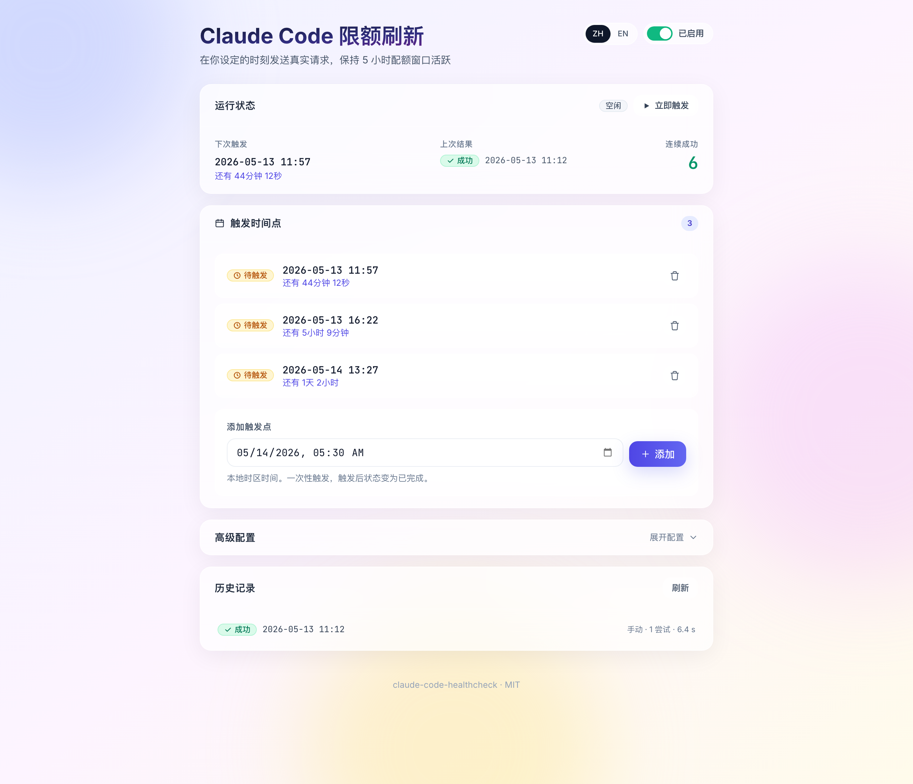
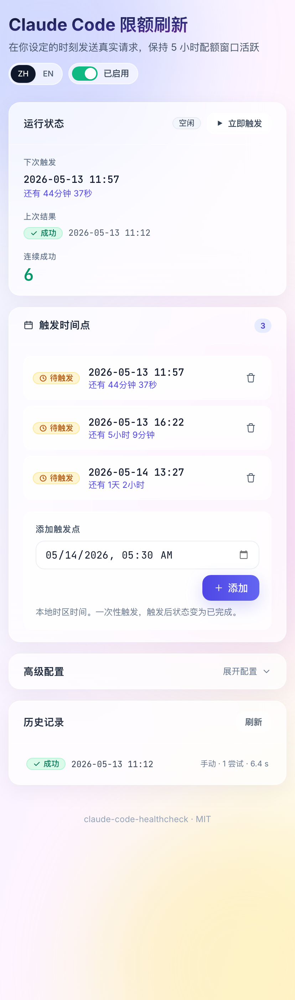
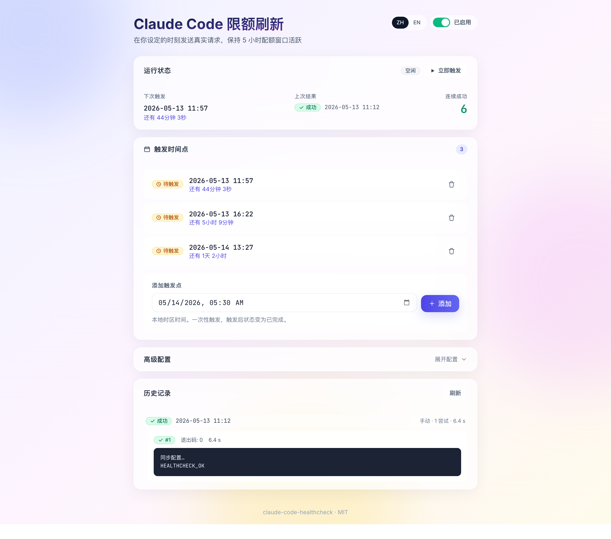

# claude-quota-warmer

> Keep your Claude Code 5-hour quota window warm by firing one real
> request at moments you choose.
>
> **中文用户**：请直接看 **[中文用户手册](./docs/USER_GUIDE.zh-CN.md)**。

A small daemon + web UI for Claude Code (or [reclaude](https://github.com/xtianowner/reclaude))
users. You stage a list of absolute datetimes ("2026-05-14 05:30 local
time") and the daemon spawns one real `claude -p ...` call at each
moment, verifies the response, retries on failure, and records the
result. Local-only — nothing leaves your machine except the request
that Claude Code itself makes.

<p align="center">
  
</p>

<p align="center">
  
  &nbsp;
  
</p>

## Why

Claude Code plans grant quota in **rolling 5-hour windows**. Unused
quota inside a window can't be carried over. If you don't touch
Claude Code for half a day, the windows that pass empty are gone.

This tool lets you say "fire one healthcheck at these specific times"
so otherwise-idle windows count as used. It deliberately does *not*
pulse continuously — you choose the moments.

> The request itself consumes a tiny bit of quota. The point is that
> one cheap healthcheck per window is a lot less than forfeiting the
> whole window.

## Features

- **Two scheduling modes**
  - **Manual** — stage any number of absolute datetimes; each fires once
  - **Auto (reclaude)** — polls reclaude's carpool-quota API every 10 min,
    reads `resets_at_ms` from the live 5h window, and keeps one upcoming
    point at `resets_at_ms + 30s` so the next window is touched the moment
    the old one expires
- **Retry to success** — failed attempts retry with configurable
  exponential backoff before being marked failed
- **Real-output validation** — checks the subprocess's actual stdout
  for a marker; not a hardcoded green pixel ([see VERIFICATION.md](./docs/VERIFICATION.md))
- **Persistent across reboots** — installs a macOS LaunchAgent or
  Linux systemd user unit that keeps the daemon alive
- **Web UI** — glassmorphism dashboard, responsive down to 320px,
  zh/en bilingual
- **Local-only** — daemon binds to `127.0.0.1:8765`; no auth, no
  telemetry. Credentials live in `data/secrets.json` (chmod 0600).
- **MIT licensed**

## Quick start

Requires **Python ≥ 3.10**, **Node.js ≥ 18** (for the one-time UI
build), and an authenticated **`claude`** or **`reclaude`** CLI on
your `PATH`.

```bash
git clone https://github.com/xtianowner/claude-quota-warmer.git
cd claude-quota-warmer
./scripts/install.sh
```

Then open <http://127.0.0.1:8765>:

**Manual mode** (default):

1. Click **Add a trigger point**, pick a future datetime, **Add**.
2. Click the **Enabled** toggle in the top-right.
3. Optional: click **Trigger now** to verify everything works.

**Auto mode** (reclaude users):

1. In the **Scheduling mode** card, pick **Auto (reclaude)**.
2. Enter your reclaude email + password, click **Login & enable**.
3. Click the **Enabled** toggle. The next auto point will appear in the
   schedule list within seconds and will track each new 5h window.

That's the whole flow. The full [User guide](./docs/USER_GUIDE.md)
covers configuration, troubleshooting, and uninstalling.

## How it works

```
launchd / systemd → python -m backend.main (127.0.0.1:8765)
                    │
                    ├─ FastAPI: REST + serves the React SPA
                    ├─ APScheduler:
                    │     · one DateTrigger per pending schedule point
                    │     · one IntervalTrigger (10 min) for auto mode
                    └─ DateTrigger fires:
                          asyncio.create_subprocess_exec(reclaude, -p, prompt)
                          → check exit==0 AND marker in stdout
                          → retry with backoff on failure
                          → persist RunRecord

  auto mode poll (every 10 min, only when mode == auto_reclaude):
    GET https://reclaude.ai/api/app/billing/carpool-quota   (cookie: rc_sid)
    → if 401, POST /api/auth/login with stored password → refresh cookie
    → desired_fire_at = max(resets_at_ms, now) + 30s
    → ensure exactly one future "source=auto" SchedulePoint matches
      (add / replace if drift > 60s / leave alone)
```

Storage:
- `data/config.json` — your settings + the schedule point list (incl.
  selected mode and reclaude email)
- `data/secrets.json` — `rc_sid` cookie + password (chmod 0600). Never
  in `config.json`, never in API responses.
- `data/runs.jsonl` — append-only run history with per-attempt detail

Architecture diagram, data model, and lifecycle details are in
[ARCHITECTURE.md](./docs/ARCHITECTURE.md).

## Docs

| | |
|---|---|
| **[用户手册（中文）](./docs/USER_GUIDE.zh-CN.md)** | 中文使用指南：安装、配置、界面逐块说明、故障排查、FAQ |
| [User guide (English)](./docs/USER_GUIDE.md) | Day-to-day usage, troubleshooting, FAQs |
| [Architecture](./docs/ARCHITECTURE.md) | Internal design, modules, data flow |
| [API reference](./docs/API.md) | REST endpoints; OpenAPI live at `/docs` |
| [Verification](./docs/VERIFICATION.md) | How to prove the success badge isn't fake |
| [Lessons](./docs/LESSONS.md) | Design decisions retired during development |

## Development

```bash
./scripts/dev.sh
# backend on :8765 with --reload
# vite dev on :5173 (proxies /api to :8765)
```

Open <http://127.0.0.1:5173>.

The `scripts/dev/` directory has Playwright-based visual audit
scripts used during UI work. See [scripts/dev/README.md](./scripts/dev/README.md).

## Project status

Early. Works on macOS (tested). Linux systemd path included but
lightly tested. Windows is not supported (use WSL).

PRs welcome — especially Linux corrections, additional locales,
alternative service backends (cron, NSSM for Windows), or
verification additions.

## License

MIT — see [LICENSE](./LICENSE).
